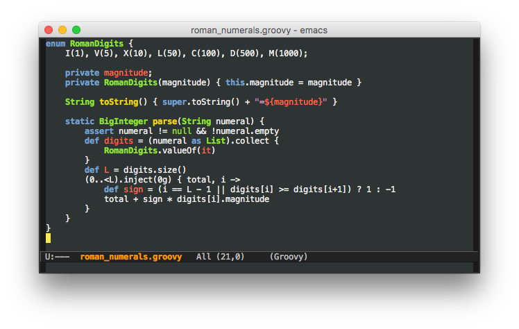

# Emacs Modes for Groovy and Grails

[](https://coveralls.io/github/Groovy-Emacs-Modes/groovy-emacs-modes?branch=master)
[](https://www.gnu.org/licenses/gpl-3.0.txt)
[](https://melpa.org/#/groovy-mode)
[](https://stable.melpa.org/#/groovy-mode)

This repository contains Emacs modes for Groovy and Grails. The major
features are syntax highlighting with `groovy-mode`, REPL integration
with `run-groovy` and Grails project navigation with `grails-mode`.

## Installation

Emacs 24+ is required.

These packages are available on [MELPA](http://melpa.org/). To use
rolling releases:

``` emacs-lisp
(require 'package)
(add-to-list 'package-archives
             '("melpa" . "https://melpa.org/packages/") t)
(package-initialize)
```

Alternatively, if you just want stable releases:

``` emacs-lisp
(require 'package)
(add-to-list 'package-archives
             '("melpa-stable" . "https://stable.melpa.org/packages/") t)
(package-initialize)
```

## A Bit of History

This mode was originally developed as a derived mode of `java-mode` (a derived mode of `cc-mode`) inspired
by Dylan R.E. Moonfire's C# mode. There are however what seem to be insurmountable obstacles to making
`groovy-mode` based on CC Mode work as people want.  Wilfred Hughes created a new `groovy-mode` (standalone)
independent of CC Mode.

The CC Mode version of `groovy-mode` used to be master, and is the basis for the 1.0.1 version on MELPA. The
work on standlone `groovy-mode` happened on a feature branch. As of 2017-05-08T08:00+01:00, the CC Mode
version has been switched to the 1.X branch and the standalone version is now master and will be released as
2.0.0 as soon as viable.

## cc-mode derived mode

The CC Mode version of `groovy-mode` is configured by overriding `cc-mode`
settings, such as `c-basic-offset`.

## Standalone mode (the default)

The new, and now default, standalone mode provides more robust highlighting and indentation, plus niceties
like string interpolation highlighting, compared to the CC Mode based version..



You can configure the standalone `groovy-mode` with `M-x customize`,
and searching for `groovy`.
